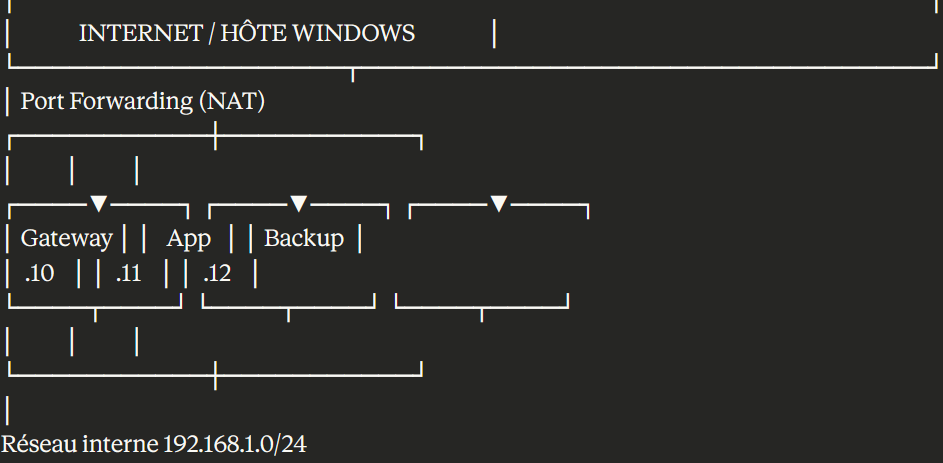

# PROJET INFRASTRUCTURE RÉSEAUX - SERVICES LINUX

## 👤 Informations

- **Étudiant** : [TON NOM]
- **Formation** : 2ème année Informatique - Spécialisation Cybersécurité
- **Date** : 26 Janvier 2026
- **Projet** : Infrastructure réseau Linux avec services, conteneurisation, monitoring et backups

---

## 📋 Table des matières

1. [Vue d'ensemble](#vue-densemble)
2. [Architecture](#architecture)
3. [Services déployés](#services-déployés)
4. [Configuration réseau](#configuration-réseau)
5. [Déploiement](#déploiement)
6. [Accès aux services](#accès-aux-services)
7. [Sauvegardes](#sauvegardes)
8. [Monitoring](#monitoring)
9. [Sécurité](#sécurité)
10. [Commandes utiles](#commandes-utiles)
11. [Troubleshooting](#troubleshooting)
12. [Améliorations futures](#améliorations-futures)

---

## 🎯 Vue d'ensemble

Ce projet implémente une infrastructure complète de 3 serveurs virtuels sous Ubuntu Server 22.04 LTS, comprenant :

- **Services réseau** : DNS local, reverse proxy HTTPS
- **Conteneurisation** : Application web avec Docker Compose
- **Monitoring** : Stack Prometheus + Grafana pour la supervision
- **Sauvegardes automatisées** : Système de backup quotidien avec rsync

### Objectifs pédagogiques

- Administration système Linux
- Configuration de services réseau
- Conteneurisation avec Docker
- Automatisation (scripts, cron)
- Monitoring et supervision
- Gestion des sauvegardes

---

## 🏗️ Architecture

### Schéma global



# PROJET INFRASTRUCTURE RÉSEAUX - SERVICES LINUX

## 👤 Informations

- **Étudiant** : [TON NOM]
- **Formation** : 2ème année Informatique - Spécialisation Cybersécurité
- **Date** : 26 Janvier 2026
- **Projet** : Infrastructure réseau Linux avec services, conteneurisation, monitoring et backups

---

## 📋 Table des matières

1. [Vue d'ensemble](#vue-densemble)
2. [Architecture](#architecture)
3. [Services déployés](#services-déployés)
4. [Configuration réseau](#configuration-réseau)
5. [Déploiement](#déploiement)
6. [Accès aux services](#accès-aux-services)
7. [Sauvegardes](#sauvegardes)
8. [Monitoring](#monitoring)
9. [Sécurité](#sécurité)
10. [Commandes utiles](#commandes-utiles)
11. [Troubleshooting](#troubleshooting)
12. [Améliorations futures](#améliorations-futures)

---

## 🎯 Vue d'ensemble

Ce projet implémente une infrastructure complète de 3 serveurs virtuels sous Ubuntu Server 22.04 LTS, comprenant :

- **Services réseau** : DNS local, reverse proxy HTTPS
- **Conteneurisation** : Application web avec Docker Compose
- **Monitoring** : Stack Prometheus + Grafana pour la supervision
- **Sauvegardes automatisées** : Système de backup quotidien avec rsync

### Objectifs pédagogiques

- Administration système Linux
- Configuration de services réseau
- Conteneurisation avec Docker
- Automatisation (scripts, cron)
- Monitoring et supervision
- Gestion des sauvegardes

---

## 🏗️ Architecture

### Schéma global
```
┌─────────────────────────────────────────────────────┐
│              INTERNET / HÔTE WINDOWS                │
└───────────────────┬─────────────────────────────────┘
                    │ Port Forwarding (NAT)
        ┌───────────┼───────────┐
        │           │           │
   ┌────▼────┐ ┌────▼────┐ ┌────▼────┐
   │ Gateway │ │   App   │ │ Backup  │
   │  .10    │ │  .11    │ │  .12    │
   └────┬────┘ └────┬────┘ └────┬────┘
        │           │           │
        └───────────┼───────────┘
                    │
          Réseau interne 192.168.1.0/24
```

### Détails des VMs

| VM | Hostname | IP | RAM | Disque | Rôle |
|----|----------|--------|-----|--------|------|
| Gateway | gateway | 192.168.1.10 | 1 GB | 10 GB | Point d'entrée, DNS, reverse proxy, monitoring |
| App | gateway | 192.168.1.11 | 2 GB | 10 GB | Hébergement application conteneurisée |
| Backup | gateway | 192.168.1.12 | 1 GB | 10 GB | Serveur de sauvegarde dédié |

> **Note** : Les 3 VMs ont le hostname "gateway" mais sont distinguées par leur IP.

---

## 📦 Services déployés

### VM1 - Gateway (192.168.1.10)

**Services système :**
- **dnsmasq** (port 53) : DNS local pour résolution de noms
- **nginx** (ports 80/443) : Reverse proxy HTTPS avec certificat SSL
- **prometheus-node-exporter** (port 9100) : Exposition métriques système

**Conteneurs Docker :**
- **prometheus** (port 9091) : Collecte et stockage des métriques
- **grafana** (port 3001) : Visualisation et dashboards
- **node-exporter** (port 9100) : Métriques système conteneurisées

---

### VM2 - App (192.168.1.11)

**Services système :**
- **docker** : Moteur de conteneurisation
- **docker-compose** : Orchestration multi-conteneurs
- **prometheus-node-exporter** (port 9100) : Exposition métriques système

**Conteneurs Docker :**
- **app-web** (nginx:alpine, port 8080) : Serveur web de l'application
- **app-db** (mysql:8) : Base de données MySQL

---

### VM3 - Backup (192.168.1.12)

**Services système :**
- **rsync** : Outil de synchronisation
- **cron** : Planificateur de tâches
- **prometheus-node-exporter** (port 9100) : Exposition métriques système

**Scripts personnalisés :**
- **backup.sh** : Script de sauvegarde automatisé avec logging

---

## 🌐 Configuration réseau

### Interfaces réseau

Chaque VM possède **2 interfaces réseau** :

**Carte 1 (enp0s3) - NAT :**
- Accès Internet
- Port forwarding vers Windows
- Configuration DHCP

**Carte 2 (enp0s8) - Réseau interne :**
- Communication inter-VMs
- Réseau 192.168.1.0/24
- IP statiques

### Configuration Netplan

Exemple pour Gateway (`/etc/netplan/00-installer-config.yaml`) :
```yaml
network:
  version: 2
  ethernets:
    enp0s3:
      dhcp4: true
    enp0s8:
      addresses:
        - 192.168.1.10/24
```

### Port forwarding VirtualBox

| Service | VM | Port hôte | Port invité |
|---------|-----|-----------|-------------|
| SSH Gateway | Gateway | 2221 | 22 |
| SSH App | App | 2222 | 22 |
| SSH Backup | Backup | 2223 | 22 |
| HTTP | Gateway | 80 | 80 |
| HTTPS | Gateway | 443 | 443 |
| Application | App | 8080 | 8080 |
| Grafana | Gateway | 3001 | 3001 |
| Prometheus | Gateway | 9091 | 9091 |

---

## 🚀 Déploiement

### Prérequis

- VirtualBox installé
- Ubuntu Server 22.04 LTS (ISO)
- 4 GB RAM minimum sur la machine hôte
- 30 GB d'espace disque libre

### Installation des VMs

1. **Créer 3 VMs dans VirtualBox**
   - OS : Ubuntu Server 22.04 LTS
   - Configurer 2 cartes réseau par VM (NAT + Réseau interne)
   - Configurer le port forwarding

2. **Configuration réseau**
```bash
   sudo nano /etc/netplan/00-installer-config.yaml
   # Configurer les IPs statiques
   sudo netplan apply
```

3. **Installation des services**

   **Gateway :**
```bash
   # DNS
   sudo apt install dnsmasq -y
   
   # Reverse proxy
   sudo apt install nginx -y
   
   # Monitoring
   sudo apt install prometheus-node-exporter -y
   
   # Docker pour la stack monitoring
   curl -fsSL https://get.docker.com | sudo sh
   sudo apt install docker-compose -y
```

   **App :**
```bash
   # Docker
   curl -fsSL https://get.docker.com | sudo sh
   sudo apt install docker-compose -y
   
   # Monitoring
   sudo apt install prometheus-node-exporter -y
```

   **Backup :**
```bash
   # Outils backup
   sudo apt install rsync -y
   
   # Monitoring
   sudo apt install prometheus-node-exporter -y
```

---

## 🌐 Accès aux services

### Depuis le navigateur Windows

| Service | URL | Login |
|---------|-----|-------|
| Application web | http://localhost:8080 | - |
| Reverse proxy HTTPS | https://localhost | - |
| Grafana | http://localhost:3001 | admin / admin123 |
| Prometheus | http://localhost:9091 | - |

### Connexions SSH
```bash
# Gateway
ssh adminn@localhost -p 2221

# App
ssh adminn@localhost -p 2222

# Backup
ssh adminn@localhost -p 2223
```

---

## 💾 Sauvegardes

### Fonctionnement

Le système de sauvegarde utilise **rsync** pour synchroniser les données de la VM App vers la VM Backup.

### Caractéristiques

- **Fréquence** : Quotidienne à 2h du matin (cron)
- **Méthode** : Rsync incrémental via SSH
- **Authentification** : Clés SSH (sans mot de passe)
- **Rétention** : 7 jours (nettoyage automatique)
- **Logging** : `/var/log/backup.log`

### Script de backup

Emplacement : `~/backup/backup.sh`
```bash
#!/bin/bash
set -e

BACKUP_DIR="/home/adminn/backup/data"
DATE=$(date +%Y%m%d_%H%M%S)
LOG_FILE="/var/log/backup.log"
SOURCE_HOST="192.168.1.11"
SOURCE_USER="adminn"
SOURCE_PATH="/home/adminn/app"

mkdir -p "$BACKUP_DIR"

log() {
    echo "[$(date '+%Y-%m-%d %H:%M:%S')] $1" | sudo tee -a "$LOG_FILE"
}

log "=== Début du backup ==="
log "Source: $SOURCE_USER@$SOURCE_HOST:$SOURCE_PATH"
log "Destination: $BACKUP_DIR/app_$DATE/"

if rsync -avz --delete \
    "$SOURCE_USER@$SOURCE_HOST:$SOURCE_PATH/" \
    "$BACKUP_DIR/app_$DATE/" >> "$LOG_FILE" 2>&1; then
    
    log "✅ Backup terminé avec succès"
    log "Emplacement: $BACKUP_DIR/app_$DATE/"
else
    log "❌ ERREUR: Le backup a échoué !"
    exit 1
fi

log "Nettoyage des backups > 7 jours..."
find "$BACKUP_DIR" -type d -name "app_*" -mtime +7 -exec rm -rf {} \; 2>/dev/null || true

log "=== Fin du backup ==="
```

### Planification cron
```bash
# Éditer la crontab
crontab -e

# Tâche planifiée
0 2 * * * /home/adminn/backup/backup.sh
```

### Restauration

Restaurer depuis un backup :
```bash
# Depuis la VM Backup
DERNIER_BACKUP=$(ls -t ~/backup/data/ | head -1)
rsync -avz ~/backup/data/$DERNIER_BACKUP/ adminn@192.168.1.11:/home/adminn/app/
```

---

## 📊 Monitoring

### Stack Prometheus + Grafana

**Architecture :**
```
Node Exporter (chaque VM)
    ↓ expose métriques (port 9100)
Prometheus (Gateway)
    ↓ collecte toutes les 15s
Grafana (Gateway)
    → dashboards visuels
```

### Configuration Prometheus

Fichier : `~/monitoring/prometheus.yml`
```yaml
global:
  scrape_interval: 15s

scrape_configs:
  - job_name: 'prometheus'
    static_configs:
      - targets: ['localhost:9090']

  - job_name: 'gateway'
    static_configs:
      - targets: ['192.168.1.10:9100']
        labels:
          instance: 'gateway'

  - job_name: 'app'
    static_configs:
      - targets: ['192.168.1.11:9100']
        labels:
          instance: 'app'

  - job_name: 'backup'
    static_configs:
      - targets: ['192.168.1.12:9100']
        labels:
          instance: 'backup'
```

### Docker Compose monitoring

Fichier : `~/monitoring/docker-compose.yml`
```yaml
version: '3.8'

services:
  prometheus:
    image: prom/prometheus:latest
    container_name: prometheus
    ports:
      - "9091:9090"
    volumes:
      - ./prometheus.yml:/etc/prometheus/prometheus.yml
      - prometheus-data:/prometheus
    command:
      - '--config.file=/etc/prometheus/prometheus.yml'
      - '--storage.tsdb.path=/prometheus'
    restart: unless-stopped

  node-exporter:
    image: prom/node-exporter:latest
    container_name: node-exporter
    ports:
      - "9100:9100"
    command:
      - '--path.rootfs=/host'
    volumes:
      - /:/host:ro
    restart: unless-stopped

  grafana:
    image: grafana/grafana:latest
    container_name: grafana
    ports:
      - "3001:3000"
    environment:
      - GF_SECURITY_ADMIN_PASSWORD=admin
      - GF_USERS_ALLOW_SIGN_UP=false
    volumes:
      - grafana-data:/var/lib/grafana
    restart: unless-stopped

volumes:
  prometheus-data:
  grafana-data:
```

### Métriques collectées

- **CPU** : Utilisation, load average
- **RAM** : Utilisation, disponible, cache
- **Disque** : Espace utilisé, I/O
- **Réseau** : Bande passante, paquets, erreurs

### Dashboards Grafana

**Dashboard Node Exporter (ID: 1860)**
- Vue complète d'une VM
- CPU, RAM, disque, réseau
- Processus, uptime

---

## 🔒 Sécurité

### Mesures implémentées

**Réseau :**
- Réseau interne isolé (192.168.1.0/24)
- Exposition minimale (port forwarding sélectif)
- Pas d'accès direct depuis Internet

**Chiffrement :**
- HTTPS sur Nginx (certificat SSL auto-signé)
- SSH avec authentification par clés
- Pas de mots de passe en clair

**Isolation :**
- Conteneurs Docker (isolation applicative)
- Séparation des services sur VMs distinctes
- Principe du moindre privilège

**Backups :**
- Serveur dédié (isolation)
- Connexion SSH sécurisée
- Logs de tous les backups

### Certificat SSL

Génération du certificat auto-signé :
```bash
sudo mkdir -p /etc/nginx/ssl
sudo openssl req -x509 -nodes -days 365 -newkey rsa:2048 \
  -keyout /etc/nginx/ssl/nginx.key \
  -out /etc/nginx/ssl/nginx.crt \
  -subj "/C=FR/ST=France/L=Paris/O=Projet/CN=gateway.local"
```

### SSH par clés

Configuration pour le backup automatisé :
```bash
# Sur VM Backup
ssh-keygen -t rsa -N "" -f ~/.ssh/id_rsa
ssh-copy-id adminn@192.168.1.11

# Test
ssh adminn@192.168.1.11 "echo 'SSH OK'"
```

---

## 🛠️ Commandes utiles

### Vérification de l'infrastructure

**Gateway :**
```bash
ssh adminn@localhost -p 2221

# Services
sudo systemctl status dnsmasq nginx prometheus-node-exporter

# Conteneurs
docker ps

# Réseau
ip a
ping -c 3 192.168.1.11
ping -c 3 192.168.1.12
```

**App :**
```bash
ssh adminn@localhost -p 2222

# Application
cd ~/app
docker-compose ps
docker-compose logs

# Test local
curl http://localhost:8080
```

**Backup :**
```bash
ssh adminn@localhost -p 2223

# Backups
ls -lh ~/backup/data/

# Logs
cat /var/log/backup.log

# Cron
crontab -l

# Test backup
~/backup/backup.sh
```

### Gestion des services
```bash
# Démarrer/arrêter/redémarrer
sudo systemctl start|stop|restart <service>

# Statut
sudo systemctl status <service>

# Activer au démarrage
sudo systemctl enable <service>

# Logs
sudo journalctl -u <service> -n 50
```

### Docker
```bash
# Lister les conteneurs
docker ps

# Logs d'un conteneur
docker logs <container_name>

# Redémarrer un conteneur
docker restart <container_name>

# Docker Compose
docker-compose up -d
docker-compose down
docker-compose ps
docker-compose logs
```

---

## 🔧 Troubleshooting

### Problèmes courants

**Problème : VM ne répond plus**
```bash
# Depuis VirtualBox, redémarrer la VM
# Vérifier les logs
ssh adminn@localhost -p XXXX
sudo journalctl -p err -b
```

**Problème : Service ne démarre pas**
```bash
sudo systemctl status <service>
sudo journalctl -u <service> -n 100
```

**Problème : Conteneur ne démarre pas**
```bash
docker-compose logs <service>
docker-compose restart <service>
```

**Problème : Réseau ne fonctionne pas**
```bash
# Vérifier la config
cat /etc/netplan/00-installer-config.yaml

# Réappliquer
sudo netplan apply

# Tester
ping 8.8.8.8
ping 192.168.1.XX
```

**Problème : Backup échoue**
```bash
# Voir les logs
cat /var/log/backup.log

# Tester SSH
ssh adminn@192.168.1.11 "echo OK"

# Tester rsync manuellement
rsync -avz adminn@192.168.1.11:/home/adminn/app/ /tmp/test/
```

---

## 🚀 Améliorations futures

### Automatisation

- **Ansible** : Playbooks pour déployer l'infra en 1 commande
- **Terraform** : Infrastructure as Code pour provisionner les VMs
- **CI/CD** : Pipeline GitLab CI / GitHub Actions

### Haute disponibilité

- **Load balancer** : HAProxy devant plusieurs VMs App
- **Réplication** : MySQL Master-Slave
- **Cluster** : Docker Swarm ou Kubernetes

### Monitoring avancé

- **Alerting** : Notifications Slack/Email via Alertmanager
- **Métriques applicatives** : Temps de réponse, taux d'erreur
- **Logs centralisés** : ELK Stack (Elasticsearch, Logstash, Kibana)

### Sécurité

- **Certificats Let's Encrypt** : SSL reconnu par les navigateurs
- **Firewall** : UFW configuré sur chaque VM
- **Fail2ban** : Protection contre les bruteforces
- **Backup chiffré** : GPG pour chiffrer les backups
- **Backup cloud** : Réplication vers S3/Azure

### Backup

- **Règle 3-2-1** : 3 copies, 2 supports, 1 hors site
- **Tests automatisés** : Vérification régulière des restaurations
- **BorgBackup** : Déduplication et compression
- **Versioning** : Plusieurs versions de fichiers

---

## 📚 Technologies utilisées

| Catégorie | Technologies |
|-----------|--------------|
| OS | Ubuntu Server 22.04 LTS |
| Virtualisation | VirtualBox |
| Conteneurisation | Docker, Docker Compose |
| Web | Nginx |
| DNS | dnsmasq |
| Base de données | MySQL 8 |
| Monitoring | Prometheus, Grafana, Node Exporter |
| Backup | rsync, cron, Bash |
| Sécurité | OpenSSL, SSH |
| Réseau | netplan, systemd |

---

## 📝 Compétences démontrées

- ✅ Administration système Linux
- ✅ Configuration réseau (IP statiques, NAT, port forwarding)
- ✅ Virtualisation (VirtualBox)
- ✅ Services réseau (DNS, reverse proxy HTTPS)
- ✅ Conteneurisation (Docker, Docker Compose)
- ✅ Scripting Bash
- ✅ Automatisation (cron, scripts)
- ✅ Monitoring et supervision
- ✅ Sauvegardes et restauration
- ✅ Sécurité (SSL/TLS, SSH, isolation)
- ✅ Documentation technique

---

## 📄 Licence

Projet réalisé dans le cadre de la formation en Cybersécurité - 2026

---

## 👨‍💻 Auteur

**[TON NOM]**  
Étudiant en 2ème année Informatique - Spécialisation Cybersécurité

---

**Projet réalisé en janvier 2026** 🚀